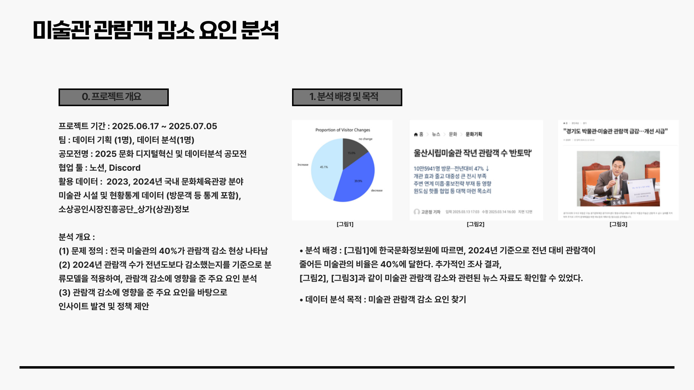
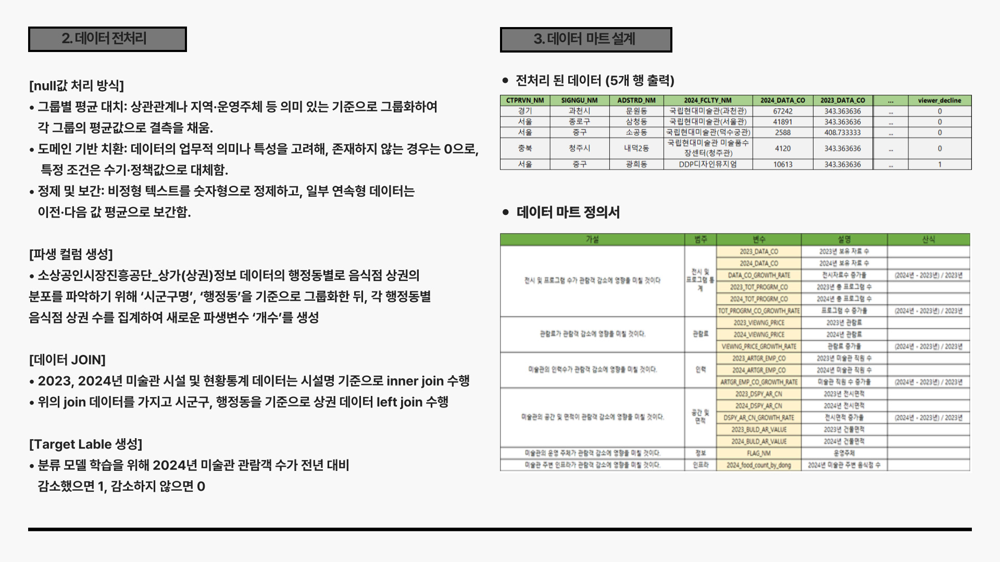
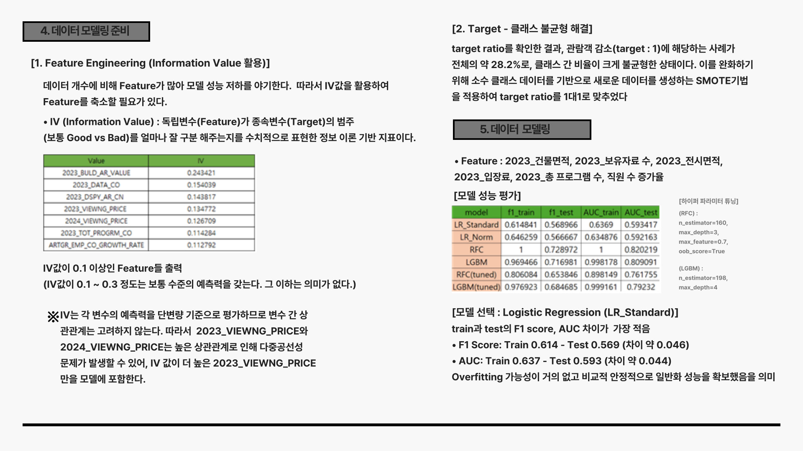
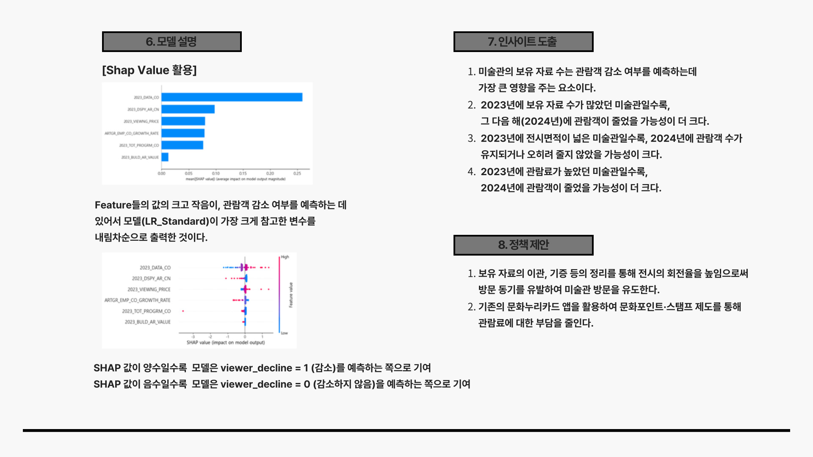

# 1. 2025 문화 디지털혁신 및 데이터분석 공모전 
### [📊 데이터 분석 보고서.pdf](./docs/Artgallery_DA.pdf)

### 📂 Repository Structure 
```bash
 ┣ 📂 business_data/              # 소상공인시장진흥공단_상가(상권)정보_데이터 (업로드x)
 ┣ 📂 data/                       # 원본 및 전처리 데이터
 ┣ 📂 docs/                       # 데이터분석 보고서
 ┣ 📂 img/                        # README 이미지
 ┣ ⚙️ .gitignore                   # Git 추적 제외 설정
 ┣ 📓 Art_EDA_Analysis_0.ipynb     # 미술관 시설 및 현황통계 데이터(EDA) 
 ┣ 📓 Art_DP_Analysis_1.ipynb      # 미술관 시설 및 현황통계 데이터 전처리
 ┣ 📓 Business_DP_2.ipynb          # 상가(상권)정보_데이터 전처리
 ┣ 📓 Art_DP_Join_3.ipynb          # 미술관 데이터와 상가(상권) 데이터 Join
 ┣ 📓 Art_IV_Analysis_4.ipynb      # Feature Engineering
 ┣ 📓 Art_MD_Analysis_5.ipynb      # Data modeling 및 model explanation
 ┗ 📘 README.md                    # 프로젝트 설명 파일
 ```

# 2. 데이터 분석 개요


# 3. 데이터 분석 프로세스 진행




# 4. 데이터 분석 결과

